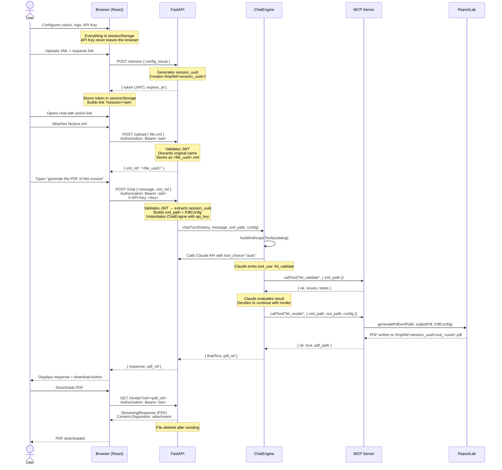
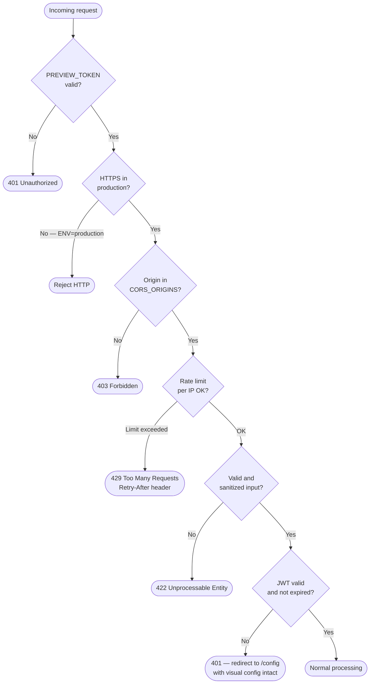
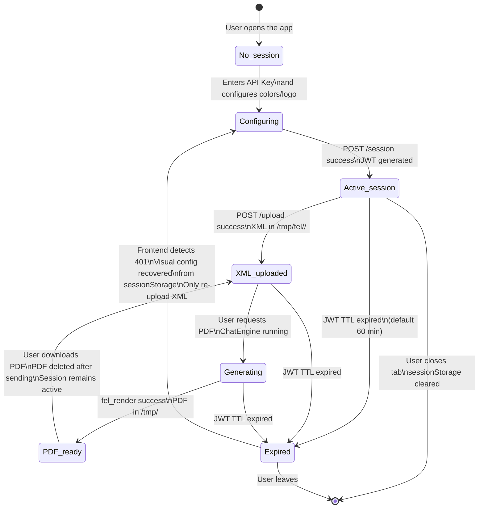
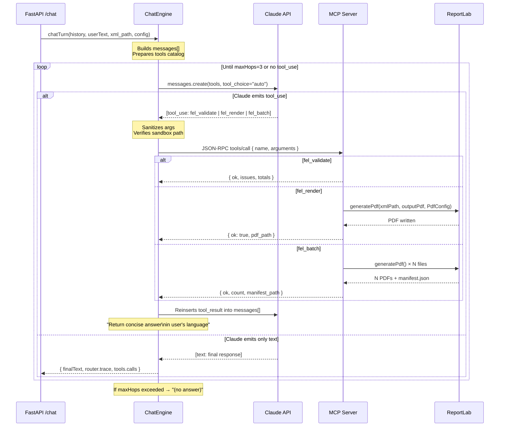
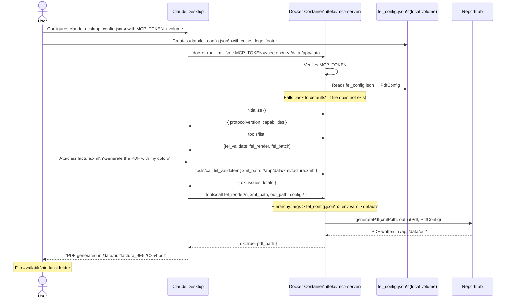
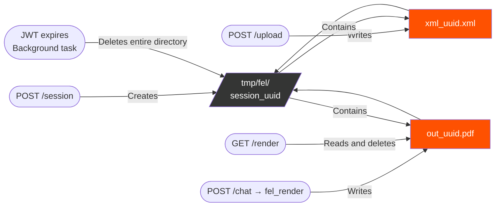

# Flow Diagrams — FEL AI Studio

Mermaid diagrams of the complete system flow in its two operating modes. Each diagram covers a different aspect of the system.

---

## 1. Full flow — Web mode (user session)

---

## 2. Security flow — Validation layers per request

---

## 3. Session flow — Full lifecycle

---

## 4. MCP flow — Internal tool-use loop

---

## 5. Docker Hub mode flow — Claude Desktop

---

## 6. Temporary file lifecycle — Web mode

---

## Related files

* `architecture/overview.md` → prose description of each component
* `architecture/stack.md` → justification of each technology
* `technical/session-model.md` → details of JWT and session isolation
* `technical/engine.md` → ChatEngine and tool-use loop implementation
* `technical/mcp-server.md` → JSON-RPC protocol and exposed tools
